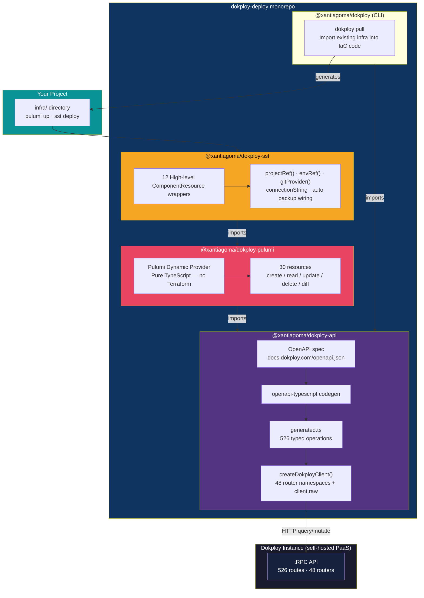
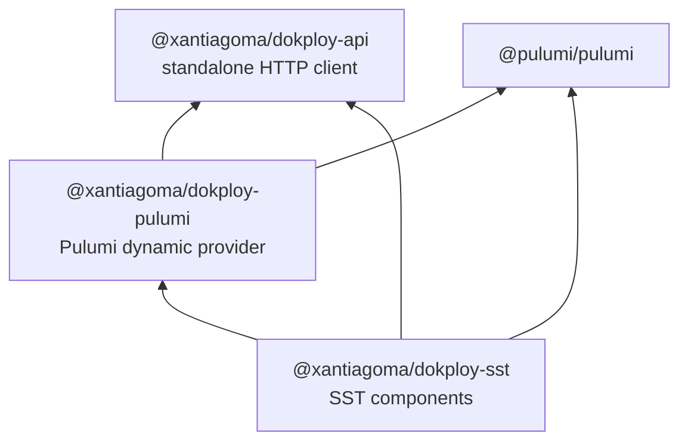
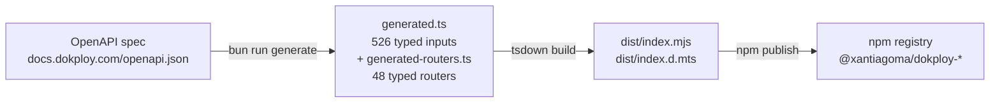

# dokploy-deploy

Declarative Infrastructure as Code for [Dokploy](https://dokploy.com) — manage your self-hosted PaaS with TypeScript.

## Packages

| Package | Description | npm |
|---------|-------------|-----|
| [`@xantiagoma/dokploy-api`](./packages/api-client) | Typed HTTP client — 526 endpoints, 48 routers, codegen'd from OpenAPI | [](https://www.npmjs.com/package/@xantiagoma/dokploy-api) |
| [`@xantiagoma/dokploy-pulumi`](./packages/pulumi) | Pulumi dynamic provider — 30 resources, pure TypeScript, no Terraform | [](https://www.npmjs.com/package/@xantiagoma/dokploy-pulumi) |
| [`@xantiagoma/dokploy-sst`](./packages/sst) | High-level SST/Pulumi components — 12 components with sensible defaults | [](https://www.npmjs.com/package/@xantiagoma/dokploy-sst) |
| [`@xantiagoma/dokploy`](./packages/cli) | CLI — pull existing infrastructure into IaC code | [](https://www.npmjs.com/package/@xantiagoma/dokploy) |

## Why?

Dokploy is a great self-hosted PaaS, but it lacks a proper IaC story. The existing Terraform providers are immature (no GitHub auto-deploy, missing resources). This project builds directly on the Dokploy tRPC API using Pulumi Dynamic Providers — TypeScript all the way down, no Go/Terraform binary needed.

## Quick Start

```bash
# Pull existing infrastructure into code (no install needed)
npx @xantiagoma/dokploy pull --url https://dokploy.example.com --key YOUR_KEY

# Or install packages for building IaC
bun add @xantiagoma/dokploy-api       # API client only
bun add @xantiagoma/dokploy-pulumi    # Pulumi IaC (includes API client)
bun add @xantiagoma/dokploy-sst       # High-level SST components (includes all)
```

### CLI — Pull Existing Infrastructure

Generate IaC code from a running Dokploy instance:

```bash
# SST format (default)
npx @xantiagoma/dokploy pull --url https://dokploy.example.com --key YOUR_KEY -o infra.ts

# Pulumi format
npx @xantiagoma/dokploy pull --url https://dokploy.example.com --key YOUR_KEY --format pulumi

# Using environment variables
DOKPLOY_URL=... DOKPLOY_API_KEY=... npx @xantiagoma/dokploy pull
```

Auto-detects `${{project.VAR}}` references and converts them to `projectRef("VAR")` calls. Resolves GitHub App installations by name via `gitProvider()`.

### Layer 1 — API Client

Direct typed access to every Dokploy endpoint:

```ts
import { createDokployClient } from "@xantiagoma/dokploy-api";

const client = createDokployClient({
  endpoint: "https://dokploy.example.com",
  apiKey: process.env.DOKPLOY_API_KEY!,
});

const projects = await client.project.all();
await client.compose.deploy({ composeId: "..." });
await client.postgres.create({ name: "db", environmentId: "...", databaseName: "app", databaseUser: "user", databasePassword: "secret" });
```

### Layer 2 — Pulumi Provider

Manage Dokploy resources with full CRUD, drift detection, and replacement logic:

```ts
import * as dokploy from "@xantiagoma/dokploy-pulumi";

const project = new dokploy.Project("my-app", {
  name: "my-app",
  description: "Production infrastructure",
});

const server = new dokploy.Compose("server", {
  name: "server",
  environmentId: project.productionEnvironmentId,
  sourceType: "github",
  owner: "myorg",
  repository: "myrepo",
  branch: "main",
  composePath: "./docker-compose.yml",
  autoDeploy: true,
  env: "NODE_ENV=production",
});

new dokploy.Domain("api", {
  host: "api.example.com",
  composeId: server.composeId,
  serviceName: "api",
  port: 3000,
  https: true,
  certificateType: "letsencrypt",
  domainType: "compose",
});

const db = new dokploy.Postgres("app-db", {
  name: "app-db",
  environmentId: project.productionEnvironmentId,
  databaseName: "appdb",
  databaseUser: "appuser",
  databasePassword: "supersecret",
});

// appName is the Docker-internal hostname (stable, use in connection strings)
export const dbHost = db.appName;
// externalPort is the internet-facing port (undefined if not configured)
export const dbPort = db.externalPort;
```

### Layer 3 — SST Components

Opinionated wrappers with env-as-object, auto domains, backup shortcuts, and `projectRef()`/`envRef()` helpers:

```ts
import { DokployProject, DokployCompose, DokployPostgres, DokployDestination, projectRef } from "@xantiagoma/dokploy-sst";

const project = new DokployProject("my-app", {
  env: { DATABASE_URL: "postgres://...", REDIS_URL: "redis://..." },
});

const destination = new DokployDestination("backups", {
  name: "backups",
  provider: "cloudflare",
  accessKey: "key-id",
  secretAccessKey: config.requireSecret("r2Secret"),
  bucket: "my-backups",
  region: "auto",
  endpoint: "https://<account>.r2.cloudflarestorage.com",
  additionalFlags: [],
});

const db = new DokployPostgres("app-db", {
  environmentId: project.productionEnvironmentId,
  databaseName: "appdb",
  databaseUser: "appuser",
  databasePassword: config.requireSecret("dbPassword"),
  backup: {
    schedule: "0 3 * * *",
    prefix: "prod-pg",
    destinationId: destination.destinationId,
    keepLatestCount: 14,
  },
});

new DokployCompose("server", {
  environmentId: project.productionEnvironmentId,
  composePath: "./docker-compose-server.yml",
  github: { owner: "myorg", repo: "myrepo" },
  env: {
    NODE_ENV: "production",
    DATABASE_URL: projectRef("DATABASE_URL"),
  },
  autoDeploy: true,
  domains: [
    { host: "api.example.com", serviceName: "api", port: 3000 },
    { host: "app.example.com", serviceName: "web", port: 5173 },
  ],
});
```

## Environment Variables

| Variable | Description |
|----------|-------------|
| `DOKPLOY_URL` | Dokploy instance URL (e.g. `https://dokploy.example.com`) |
| `DOKPLOY_API_KEY` | API key from Dashboard > Settings > Profile > API/CLI |

## Resources

### Pulumi Resources (30 total)

| Category | Resources |
|----------|-----------|
| **Project & Environments** | `Project`, `Environment` |
| **Services** | `Compose`, `Application` |
| **Routing** | `Domain`, `Port`, `Mount`, `Redirect`, `Security` |
| **Databases** | `Postgres`, `Mysql`, `Mariadb`, `Mongo`, `Redis`, `Libsql` |
| **Backups** | `Backup`, `VolumeBackup`, `Schedule`, `Destination` |
| **Infrastructure** | `Server`, `SshKey`, `Registry`, `Certificate` |
| **Tags** | `Tag` |
| **Notifications** | `SlackNotification`, `TelegramNotification`, `DiscordNotification`, `EmailNotification`, `GotifyNotification`, `NtfyNotification`, `MattermostNotification`, `CustomNotification`, `LarkNotification`, `TeamsNotification`, `PushoverNotification`, `ResendNotification` |

### SST Components (12 total)

| Component | Description |
|-----------|-------------|
| `DokployProject` | Project + production environment |
| `DokployCompose` | Docker Compose service + domains |
| `DokployApplication` | Single-container service + domains + ports + mounts |
| `DokployPostgres` | PostgreSQL + optional scheduled backup |
| `DokployMysql` | MySQL + optional scheduled backup |
| `DokployMariadb` | MariaDB + optional scheduled backup |
| `DokployMongo` | MongoDB + optional scheduled backup |
| `DokployRedis` | Redis + optional scheduled backup |
| `DokployDestination` | S3-compatible backup storage target |
| `DokployServer` | Remote server registration |
| `DokployRegistry` | Docker registry for private images |
| `DokployCertificate` | Custom SSL certificate |

## Architecture



### Dependency graph



### Codegen & build pipeline



## Development

```bash
bun install
bun run check-types   # type check all packages
bun test              # run tests (needs DOKPLOY_URL + DOKPLOY_API_KEY for integration tests)
```

## Releasing

Uses [changelogen](https://github.com/unjs/changelogen) with conventional commits:

```bash
bun run release       # bump version, update CHANGELOG.md, commit, tag, push
```

CI automatically creates a GitHub Release and publishes to npm on tag push.

## License

[MIT](./LICENSE) - Santiago Montoya
